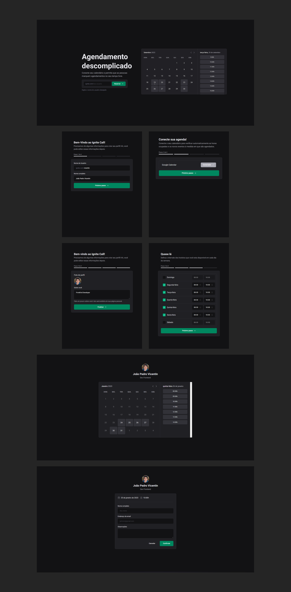

# Ignite Call

### O projeto consiste em um sistema de agendamento em que o usuário poderá efetuar o cadastro com a sua conta do Google, selecionar os dias e horários disponíveis para marcar uma reunião e automaticamente reservar o horário no Google Calendar.
<br>

 <h1 align="center">
    
 </h1>

 ##

 ## Tecnologias utilizadas

 <div style="display: inline_block"><br>
  
  
  
  
  
  
  
 
</div>
<br>

<a href="https://ignite-call-kohl.vercel.app/">Deploy na VERCEL</a>

##

```bash

#Clone este repositório
$ git clone https://github.com/JoaoPedroVicentin/ignite-call.git

#Acesse a pasta do projeto
$ cd ignite-call

#Instale as dependências
$ npm i

#Execute a aplicação em modo de desenvolvimento
$ npm run dev
```
##

<p> Feito por João Pedro Vicentin | <a href="https://www.linkedin.com/in/jo%C3%A3o-pedro-vicentin/">Linkedin</a> </p>
